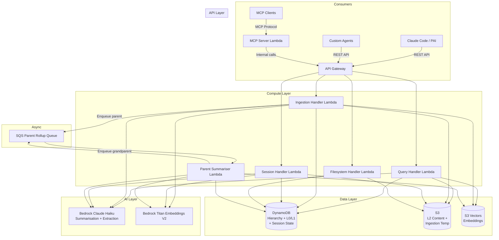
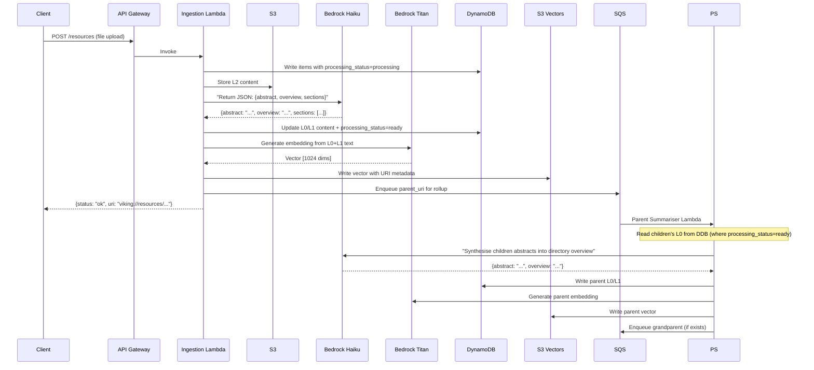
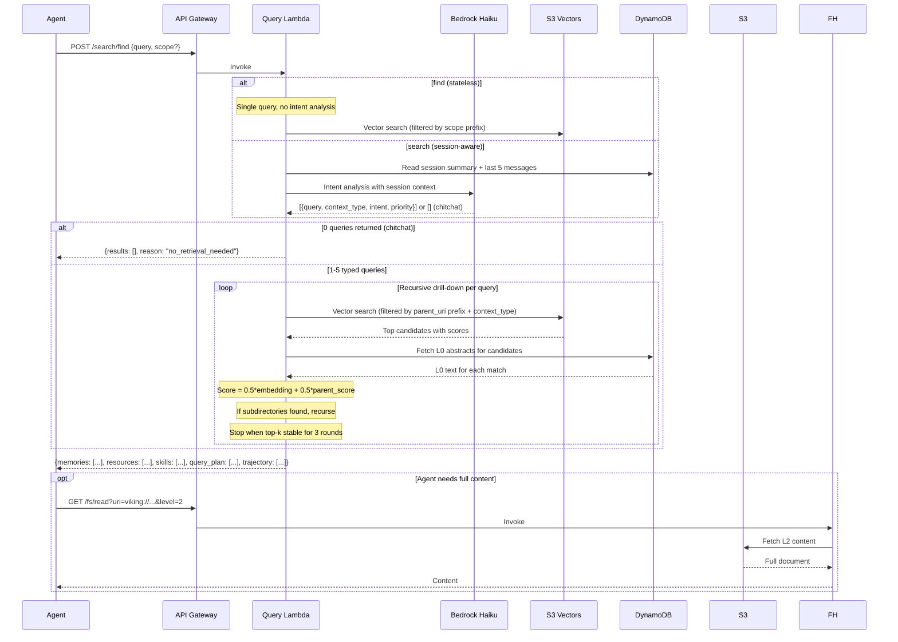
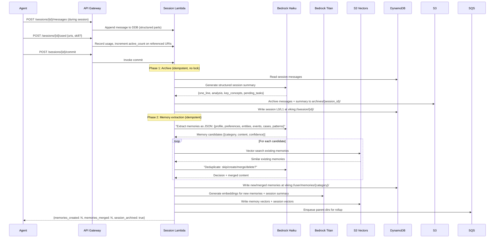
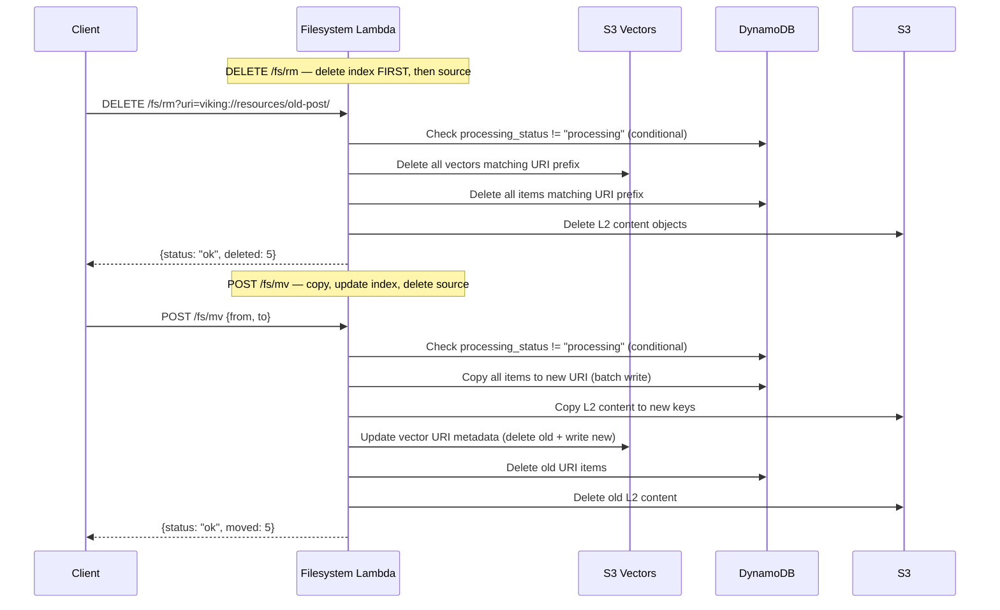

# Viking Context Service — Product Specification

## 1. Overview

**Viking Context Service (VCS)** is an AWS-native hierarchical context database for AI agents. It provides structured, token-efficient context management through three core capabilities:

1. **Hierarchical namespace** with `viking://` URIs for deterministic context navigation
2. **L0/L1/L2 tiered summarisation** enabling agents to scan cheaply (L0: ~100 tokens) before loading full content (L2) on demand
3. **Session memory extraction** that makes the corpus smarter after every interaction

The service exposes a REST API for direct integration and an MCP server for any MCP-compatible agent (Claude Code, Cursor, Amazon Q, Kiro).

**Deployment:** AWS CDK construct. Single-account, single-tenant. Each deployment is isolated by AWS account boundaries.

**Inspired by:** [OpenViking](https://github.com/ArcAI-NexGen/OpenViking) (ByteDance). VCS implements OpenViking's core patterns natively on AWS without running OpenViking itself.

---

## 2. Key Design Decisions

| Decision | Choice | Rationale |
|---|---|---|
| Vector storage | **S3 Vectors** | $0.06/GB/mo vs $175/mo minimum for OpenSearch Serverless. Acceptable latency (~100ms warm) for POC and personal use. |
| Metadata + hierarchy | **DynamoDB** | Single-digit ms latency, GSI-based tree navigation, on-demand pricing. |
| Content storage (L2) | **S3** | Unlimited, cheap, durable. L2 content is loaded on-demand, not kept in DynamoDB. |
| Summarisation engine | **Bedrock (Claude Haiku)** | Single multimodal model call per node returns L0+L1 as structured JSON. No workflow engine. |
| Embeddings | **Bedrock Titan Embeddings V2** | AWS-native, no external API key dependency. 1024 dimensions. |
| Orchestration pattern | **Lambda + SQS** | Matches OpenViking's async DAG pattern. No Step Functions. The model IS the pipeline. |
| API surface | **API Gateway + Lambda** | REST API for direct integration. MCP server as a separate Lambda for agent consumption. |
| Multi-tenancy | **AWS account isolation** | No application-level `account_id`. CDK construct deploys per-account. |
| Infrastructure as code | **CDK (TypeScript)** | Single `cdk deploy` stands up the full stack. |
| Auth | **IAM + API Gateway API keys** | IAM for service-to-service. API keys for external agent access. |
| Source of truth | **DynamoDB + S3** | DynamoDB and S3 are the authoritative data stores. S3 Vectors is a derived index, rebuildable from source. Better to miss a search result than return a bad one. |
| Consistency model | **Delete-index-first, idempotent operations** | All mutations delete the derived index before the source data. All async operations (ingestion, memory extraction) are idempotent. |

---

## 3. Architecture

### 3.1 System Overview



### 3.2 Ingestion Flow



### 3.3 Retrieval Flow



### 3.4 Session Memory Commit Flow



### 3.5 Consistency: Delete and Move Operations



---

## 4. Data Model

### 4.1 DynamoDB Table: `vcs-context`

**Primary table:**

| Key | Type | Example |
|---|---|---|
| PK | `uri` (String) | `viking://resources/docs/auth/oauth.md` |
| SK | `level` (Number) | `0`, `1`, or `2` |

**Attributes:**

| Attribute | Type | Description |
|---|---|---|
| parent_uri | String | Parent directory URI |
| context_type | String | `resource`, `memory`, `skill`, `session` |
| category | String | For memories: `profile`, `preferences`, `entities`, `events`, `cases`, `patterns` |
| content | String | L0: abstract text (~100 tokens). L1: overview text (~2k tokens). L2: S3 key reference. |
| s3_key | String | S3 object key for L2 full content (only on SK=2 items) |
| is_directory | Boolean | True for directory nodes |
| processing_status | String | `pending`, `processing`, `ready`. Guards against deletion during ingestion. |
| active_count | Number | Usage counter, incremented via `session.used()` |
| created_at | String | ISO 8601 timestamp |
| updated_at | String | ISO 8601 timestamp |

**Global Secondary Indexes:**

| GSI | PK | SK | Purpose |
|---|---|---|---|
| `parent-index` | `parent_uri` | `uri` | List children of a directory (ls) |
| `type-index` | `context_type` | `uri` | Scoped queries: "all resources", "all memories" |
| `category-index` | `category` | `updated_at` | List memories by category, sorted by recency |

**Access patterns:**

| Operation | Query |
|---|---|
| Fetch L0 only | `PK = uri, SK = 0` (single item, ~100 tokens) |
| Fetch L0 + L1 | `PK = uri, SK <= 1` (two items, ~2.1k tokens) |
| Fetch all tiers | `PK = uri` (three items) |
| List children | `parent-index: PK = parent_uri` |
| All resources | `type-index: PK = "resource"` |
| Recent memories | `category-index: PK = "preferences", SK desc` |
| Guard against delete during processing | `ConditionExpression: processing_status <> "processing"` |

### 4.2 DynamoDB Table: `vcs-sessions`

| Key | Type | Example |
|---|---|---|
| PK | `session_id` (String) | `sess_abc123` |
| SK | `entry_type#seq` (String) | `msg#0`, `msg#1`, `used#0`, `meta#0` |

**Attributes:**

| Attribute | Type | Description |
|---|---|---|
| role | String | `user`, `assistant`, `system`, `tool` |
| parts | List | Structured message parts (see below) |
| timestamp | String | ISO 8601 |
| status | String | `active`, `committed`, `archived` |
| compression_summary | String | Running session summary for search() context (on meta#0 item) |

**Message Parts:**

Each message contains a `parts` list with typed entries:

```json
[
  {"type": "text", "content": "How do I configure embeddings?"},
  {"type": "context", "uri": "viking://resources/docs/config.md", "abstract": "Configuration guide..."},
  {"type": "tool", "name": "vcs_find", "input": {"query": "embedding config"}, "output": {"results": [...]}, "success": true}
]
```

The memory extractor uses `context` parts to identify which resources were consulted, and `tool` parts to extract agent skill usage patterns.

### 4.3 S3 Bucket: `vcs-content-{account_id}`

| Prefix | Contents |
|---|---|
| `l2/` | Full L2 content files, keyed by URI hash |
| `temp/` | Ingestion temp files (auto-expired via lifecycle rule, 24h) |
| `archives/` | Archived session messages + structured summaries post-commit |
| `exports/` | Exported context packs |

### 4.4 S3 Vectors: `vcs-vectors-{account_id}`

| Field | Type | Description |
|---|---|---|
| id | String | URI + level composite |
| vector | Float[1024] | Bedrock Titan Embedding V2 |
| uri | String | viking:// URI (filterable) |
| parent_uri | String | Parent directory (filterable for scoped search) |
| context_type | String | resource/memory/skill/session (filterable) |
| level | Number | 0, 1, or 2 |
| abstract | String | L0 text for results display |

---

## 5. API Specification

### 5.1 REST API (API Gateway)

**Base URL:** `https://{api-id}.execute-api.{region}.amazonaws.com/v1`

**Authentication:** API key via `x-api-key` header, or IAM SigV4 for service-to-service.

#### Resources

| Method | Path | Description |
|---|---|---|
| `POST` | `/resources` | Ingest a new resource (file upload or URL) |
| `GET` | `/resources/{uri}` | Get resource metadata and L0/L1 |
| `DELETE` | `/resources/{uri}` | Delete resource and all child nodes (index-first) |

**POST /resources**

```json
{
  "file": "<base64 or multipart>",
  "uri_prefix": "viking://resources/blog/",
  "reason": "sjramblings.io blog post",
  "instruction": "Focus on technical opinions and AWS services mentioned"
}
```

Response:
```json
{
  "status": "ok",
  "uri": "viking://resources/blog/openviking-lightsail/",
  "sections_created": 5,
  "processing_ms": 3200
}
```

#### Search

| Method | Path | Description |
|---|---|---|
| `POST` | `/search/find` | Stateless semantic search (single query, no intent analysis) |
| `POST` | `/search/search` | Session-aware search (intent analysis using session context) |

**POST /search/find** (simple, low-latency)

```json
{
  "query": "OAuth authentication",
  "scope": "viking://resources/",
  "max_results": 5,
  "min_score": 0.4
}
```

**POST /search/search** (session-aware, richer results)

```json
{
  "query": "Help me create an RFC document",
  "session_id": "sess_abc123",
  "max_results": 5,
  "min_score": 0.4
}
```

Response (both endpoints):
```json
{
  "memories": [
    {"uri": "viking://user/memories/preferences/writing-style.md", "level": 0, "score": 0.68, "abstract": "Prefers Australian English..."}
  ],
  "resources": [
    {"uri": "viking://resources/blog/openviking-lightsail/session-memory.md", "level": 0, "score": 0.72, "abstract": "Session memory extraction uses LLM..."}
  ],
  "skills": [],
  "query_plan": [
    {"query": "RFC document template", "context_type": "resource", "intent": "find template", "priority": 1},
    {"query": "User's writing preferences", "context_type": "memory", "intent": "match style", "priority": 2}
  ],
  "trajectory": [
    {"step": 1, "action": "global_search", "candidates": 3},
    {"step": 2, "action": "drill", "uri": "viking://resources/blog/", "score": 0.68},
    {"step": 3, "action": "converged", "rounds": 2}
  ],
  "reason": null,
  "tokens_saved_estimate": 15200
}
```

When intent analysis returns 0 queries (chitchat/greetings):
```json
{
  "memories": [],
  "resources": [],
  "skills": [],
  "query_plan": [],
  "trajectory": [],
  "reason": "no_retrieval_needed",
  "tokens_saved_estimate": 0
}
```

#### Filesystem Operations

| Method | Path | Description |
|---|---|---|
| `GET` | `/fs/ls` | List children of a URI |
| `GET` | `/fs/tree` | Recursive tree from URI |
| `GET` | `/fs/read` | Read content at specific level |
| `POST` | `/fs/mkdir` | Create directory node |
| `DELETE` | `/fs/rm` | Remove node (delete index first, then source, guard against processing) |
| `POST` | `/fs/mv` | Move/rename node (copy-then-update-then-delete) |

**GET /fs/read?uri=viking://resources/blog/openviking-lightsail/&level=0**

Response:
```json
{
  "uri": "viking://resources/blog/openviking-lightsail/",
  "level": 0,
  "content": "Guide to deploying OpenViking context database on AWS Lightsail with Docker...",
  "tokens": 87
}
```

#### Sessions

| Method | Path | Description |
|---|---|---|
| `POST` | `/sessions` | Create new session |
| `POST` | `/sessions/{id}/messages` | Add structured message to session |
| `POST` | `/sessions/{id}/used` | Record context/skill usage (increments active_count) |
| `POST` | `/sessions/{id}/commit` | Archive + extract memories (two-phase, idempotent) |
| `GET` | `/sessions/{id}` | Get session state + compression summary |
| `DELETE` | `/sessions/{id}` | Delete session |

**POST /sessions/{id}/messages**

```json
{
  "role": "assistant",
  "parts": [
    {"type": "text", "content": "Here is how to configure embeddings..."},
    {"type": "context", "uri": "viking://resources/docs/config.md", "abstract": "Configuration reference for VCS..."},
    {"type": "tool", "name": "vcs_find", "input": {"query": "embedding config"}, "output": {"results": ["..."]}, "success": true}
  ]
}
```

**POST /sessions/{id}/used**

```json
{
  "uris": ["viking://resources/docs/config.md", "viking://user/memories/preferences/coding-style.md"],
  "skill": {
    "uri": "viking://agent/skills/code-search",
    "input": "search config files",
    "output": "found 3 matches",
    "success": true
  }
}
```

**POST /sessions/{id}/commit**

Response:
```json
{
  "status": "ok",
  "memories_created": 3,
  "memories_merged": 1,
  "memories_skipped": 2,
  "categories": {
    "preferences": 1,
    "entities": 2,
    "patterns": 1
  },
  "session_summary": {
    "one_line": "Configured VCS embeddings: explored Titan vs OpenAI | success | complete",
    "key_concepts": ["embedding dimensions", "Titan Embeddings V2", "cosine similarity"]
  },
  "session_uri": "viking://session/sess_abc123/",
  "archived_messages": 24
}
```

### 5.2 MCP Server

The MCP server runs as a separate Lambda behind API Gateway, translating MCP protocol to VCS REST API calls. It exposes VCS capabilities as MCP tools:

**MCP Tools:**

| Tool | Description | Maps to |
|---|---|---|
| `vcs_find` | Stateless semantic search with optional scope | `POST /search/find` |
| `vcs_search` | Session-aware search with intent analysis | `POST /search/search` |
| `vcs_read` | Read content at specific level | `GET /fs/read` |
| `vcs_ls` | List directory contents | `GET /fs/ls` |
| `vcs_tree` | Show directory tree | `GET /fs/tree` |
| `vcs_ingest` | Add a resource to the corpus | `POST /resources` |
| `vcs_add_message` | Record a structured message in the current session | `POST /sessions/{id}/messages` |
| `vcs_used` | Record which contexts/skills were used | `POST /sessions/{id}/used` |
| `vcs_commit_session` | Extract memories and archive session | `POST /sessions/{id}/commit` |

**MCP Tool Definition Example (vcs_search):**

```json
{
  "name": "vcs_search",
  "description": "Session-aware search using intent analysis. Feeds session context into query decomposition for richer retrieval. Returns results grouped by type (memories, resources, skills). Use vcs_find for simple stateless queries.",
  "inputSchema": {
    "type": "object",
    "properties": {
      "query": {"type": "string", "description": "Natural language search query"},
      "session_id": {"type": "string", "description": "Current session ID for context"},
      "max_results": {"type": "number", "default": 5}
    },
    "required": ["query", "session_id"]
  }
}
```

**Agent Integration Pattern:**

An agent using VCS follows a three-step retrieval pattern that mirrors human browsing:

1. **Scan** — call `vcs_search` (or `vcs_find` for simple queries) to get L0 abstracts (~100 tokens each). Cost: 500-1000 tokens for 5-10 results.
2. **Decide** — read the abstracts, identify which 1-2 are relevant.
3. **Load** — call `vcs_read` with `level=2` only for the relevant items. Cost: 2000-4000 tokens per document.

This replaces the traditional RAG pattern of loading full chunks for all results (10,000-20,000 tokens), achieving 75-85% token reduction.

**Session lifecycle in agent code:**

```
1. Create session (once per conversation)
2. For each turn:
   a. vcs_search with session_id (retrieval benefits from context)
   b. vcs_read for relevant L2 content
   c. vcs_add_message (record what happened)
   d. vcs_used (record which URIs were consulted)
3. At conversation end: vcs_commit_session
```

**Claude Code Skill Integration:**

A `viking-context` skill in Claude Code's CLAUDE.md or as a registered skill:

```markdown
## Viking Context Service

Before drafting new content or answering questions about existing work:
1. Call vcs_search with the topic and current session_id
2. Review the L0 abstracts in the grouped results (memories, resources, skills)
3. Call vcs_read level=2 only for relevant hits
4. Use the context to inform your response
5. Call vcs_used to record which URIs you consulted

After each session:
1. Call vcs_commit_session to extract and store memories
```

---

## 6. AWS Services Summary

| Service | Purpose | Pricing Model |
|---|---|---|
| **API Gateway** (REST) | HTTP API for all endpoints | $1/million requests + data transfer |
| **Lambda** (5 functions) | All compute: ingestion, query, session, filesystem, parent rollup | $0.20/million invocations + duration |
| **DynamoDB** (2 tables) | Hierarchy metadata, L0/L1 content, session state | On-demand: $1.25/million writes, $0.25/million reads |
| **S3** (1 bucket) | L2 content, temp files, session archives | $0.023/GB/mo storage |
| **S3 Vectors** (1 index) | Vector embeddings with metadata filtering | $0.06/GB/mo + query charges |
| **SQS** (1 queue + 1 DLQ) | Bottom-up parent rollup ordering | $0.40/million messages |
| **Bedrock Claude Haiku** | Summarisation, intent analysis, memory extraction, dedup | $0.25/million input tokens, $1.25/million output tokens |
| **Bedrock Titan Embeddings V2** | Vector generation (1024 dims) | $0.02/million input tokens |
| **Secrets Manager** | API keys, Bedrock access config | $0.40/secret/mo |
| **CloudWatch** | Logs, metrics, alarms | Standard pricing |
| **X-Ray** | Retrieval trajectory tracing | $5/million traces |

**Estimated monthly cost at POC scale (personal use, <100 documents):** $10-18/mo

---

## 7. CDK Stack Structure

```
vcs/
├── bin/
│   └── vcs.ts                    # CDK app entry
├── lib/
│   ├── vcs-stack.ts              # Main stack
│   ├── constructs/
│   │   ├── data-layer.ts         # DynamoDB tables + S3 bucket + S3 Vectors
│   │   ├── compute-layer.ts      # Lambda functions + SQS queue + DLQ
│   │   ├── api-layer.ts          # API Gateway + routes
│   │   ├── mcp-server.ts         # MCP Lambda + API Gateway route
│   │   └── observability.ts      # CloudWatch dashboards + X-Ray
│   └── config.ts                 # Environment config (region, model IDs)
├── lambda/
│   ├── ingestion/
│   │   ├── handler.ts            # Parse + summarise + vectorise
│   │   └── parsers/              # Markdown, PDF, HTML parsers
│   ├── query/
│   │   ├── handler.ts            # find() + search() with intent analysis
│   │   ├── intent-analyzer.ts    # Session-aware query decomposition
│   │   └── retrieval.ts          # Recursive drill-down algorithm
│   ├── session/
│   │   ├── handler.ts            # Session CRUD + commit (two-phase)
│   │   ├── memory-extractor.ts   # 6-category extraction + dedup
│   │   └── usage-tracker.ts      # active_count increment logic
│   ├── filesystem/
│   │   ├── handler.ts            # ls, tree, read, mkdir
│   │   ├── delete.ts             # rm with index-first ordering + processing guard
│   │   └── move.ts               # mv with copy-update-delete protocol
│   ├── parent-summariser/
│   │   └── handler.ts            # Bottom-up L0/L1 rollup
│   └── mcp-server/
│       └── handler.ts            # MCP protocol → REST API translation
├── test/
│   ├── unit/                     # Per-function unit tests
│   ├── integration/              # End-to-end API tests
│   └── eval/                     # Retrieval evaluation suite
├── eval/
│   └── golden-dataset.json       # Hand-curated queries + expected results
├── cdk.json
├── package.json
└── tsconfig.json
```

**Single command deployment:**

```bash
npx cdk deploy VikingContextServiceStack
```

---

## 8. Security Architecture

| Layer | Implementation |
|---|---|
| **Network** | API Gateway with WAF. Lambda runs in VPC with private subnets. No public endpoints beyond API Gateway. |
| **Authentication** | API Gateway API keys for external access. IAM SigV4 for service-to-service (MCP server → REST API). |
| **Authorisation** | Lambda execution roles with least-privilege policies. Separate roles per function. |
| **Encryption at rest** | DynamoDB: AWS-managed encryption. S3: SSE-S3 (default) or SSE-KMS. S3 Vectors: encrypted by default. |
| **Encryption in transit** | TLS 1.2 minimum on all endpoints. |
| **Secrets** | API keys in Secrets Manager with rotation support. No plaintext credentials anywhere. |
| **Audit** | CloudTrail on all API calls. CloudWatch Logs for all Lambda invocations. |
| **Data retention** | S3 lifecycle rules: temp files expire after 24 hours. Session archives configurable. |

---

## 9. Testing and Retrieval Evaluation

### 9.1 Unit Tests

Each Lambda function has isolated unit tests covering:
- Input validation and error handling
- DynamoDB read/write operations (mocked)
- Bedrock prompt construction and response parsing
- S3 Vectors query construction and result processing
- SQS message formatting
- Delete ordering (index-first) verification
- Move protocol (copy-update-delete) verification
- Processing guard conditional write behaviour

### 9.2 Integration Tests

End-to-end tests against a deployed stack (separate test account):
- Ingest a markdown document → verify DynamoDB items at L0/L1/L2 → verify S3 Vectors record → verify processing_status=ready
- Ingest parent + child documents → verify parent rollup triggers and completes
- Attempt `rm` during processing → verify rejection with processing guard
- `find` query → verify results include expected URIs with correct scores
- `search` query with session context → verify intent analysis produces typed queries → verify grouped results
- `search` with chitchat → verify 0 queries and `reason: "no_retrieval_needed"`
- Session create → add structured messages (text + context + tool parts) → used() → commit → verify memories extracted to correct categories
- Session commit → verify session archive gets L0/L1 at `viking://session/{id}/`
- `used()` → verify `active_count` incremented on referenced URIs
- Filesystem operations: mkdir, ls, tree, mv (copy-update-delete), rm (index-first) with cascade verification
- Idempotency: commit same session twice → verify no duplicate memories created

### 9.3 Retrieval Evaluation (Golden Dataset)

**Purpose:** Measure retrieval quality with known-good queries against Steve's blog corpus.

**Golden dataset structure (`eval/golden-dataset.json`):**

```json
{
  "corpus": "sjramblings-blog-posts",
  "queries": [
    {
      "id": "q001",
      "query": "How does crypto-agility help with quantum computing threats?",
      "expected_uris": [
        "viking://resources/blog/stop-debating-quantum-breaks-rsa/"
      ],
      "expected_not_uris": [
        "viking://resources/blog/aws-config-new-resource-types/"
      ],
      "min_score": 0.5,
      "expected_level": 0,
      "notes": "Should match the quantum/RSA post, not the AWS Config post"
    },
    {
      "id": "q002",
      "query": "What container patterns work for running a context database on ECS?",
      "expected_uris": [
        "viking://resources/blog/openviking-ecs-production/"
      ],
      "min_score": 0.45,
      "expected_level": 0
    }
  ]
}
```

**Evaluation metrics:**

| Metric | Description | Target |
|---|---|---|
| **Recall@5** | Proportion of expected URIs appearing in top 5 results | >= 0.8 |
| **Precision@5** | Proportion of top 5 results that are in expected set | >= 0.6 |
| **MRR** (Mean Reciprocal Rank) | Average of 1/rank for first correct result | >= 0.7 |
| **Token efficiency** | Tokens consumed by L0 scan vs loading all L2 content | >= 75% reduction |
| **Negative exclusion** | Expected-not URIs do not appear in top 5 | 100% |

**Evaluation runner:**

```bash
# Run against deployed stack
npx ts-node eval/run-eval.ts --stack-name VikingContextServiceStack --dataset eval/golden-dataset.json
```

Output:
```
Retrieval Evaluation Results
============================
Queries:        25
Recall@5:       0.84
Precision@5:    0.68
MRR:            0.76
Token savings:  81%
Negative excl:  100%

Failed queries:
  q017: Expected viking://resources/blog/friction-was-the-point/ at rank <=5, found at rank 8
```

**Golden dataset maintenance:** Hand-curate 25-50 queries after initial corpus ingestion. Update when new posts are ingested. Re-run after any changes to the retrieval algorithm, embedding model, or prompt templates.

---

## 10. Observability

### CloudWatch Dashboard

| Widget | Metric | Alarm |
|---|---|---|
| Ingestion rate | Documents ingested / hour | None (informational) |
| Ingestion latency | P50/P90/P99 ingestion duration | P99 > 30s |
| Retrieval latency | P50/P90/P99 query duration | P99 > 2s |
| Token usage | Bedrock input/output tokens per hour | Daily spend > $5 |
| DynamoDB consumed RCU/WCU | Read/write capacity usage | Throttling events > 0 |
| S3 Vectors query latency | P50/P90 vector search duration | P90 > 500ms |
| SQS queue depth | Messages in parent rollup queue | Depth > 100 (backlog) |
| SQS DLQ depth | Failed messages | Any > 0 |
| Lambda errors | Error count per function | Any errors > 0 |
| Session commits | Memories created/merged per commit | None (informational) |
| Active count distribution | Most-used URIs by active_count | None (informational) |

### X-Ray Tracing

Every retrieval request is traced end-to-end:
- Intent analysis Bedrock call duration
- Each recursive drill-down step (vector search + DynamoDB lookup)
- Final result assembly

Trace data powers the retrieval trajectory in the API response, making retrieval decisions observable and debuggable.

---

## 11. Configuration

**CDK context (`cdk.json`):**

```json
{
  "context": {
    "vcs:region": "ap-southeast-2",
    "vcs:bedrockSummarisationModel": "anthropic.claude-3-haiku-20240307-v1:0",
    "vcs:bedrockEmbeddingModel": "amazon.titan-embed-text-v2:0",
    "vcs:embeddingDimension": 1024,
    "vcs:maxRecursionDepth": 5,
    "vcs:convergenceRounds": 3,
    "vcs:scorePropagationAlpha": 0.5,
    "vcs:globalSearchTopK": 3,
    "vcs:l0MaxTokens": 100,
    "vcs:l1MaxTokens": 2000,
    "vcs:tempFileExpiryHours": 24,
    "vcs:sessionArchiveRetentionDays": 90
  }
}
```

All configuration is CDK context. No runtime config files. Model IDs, retrieval parameters, and retention policies are set at deploy time and baked into Lambda environment variables.

---

## 12. V2 Backlog

The following features are deferred to V2. They add value but are not required for a functional service:

| Feature | Description | Why deferred |
|---|---|---|
| **Rerank model support** | Optional rerank step after vector retrieval using a dedicated rerank model (e.g. Cohere Rerank via Bedrock). Refines scoring after the recursive drill-down. More relevant when corpus grows large and S3 Vectors precision becomes a bottleneck. | Not needed at POC scale. Evaluate after golden dataset results indicate precision issues. |
| **Relations/links between resources** | `POST /fs/link` to create directional edges between related resources (e.g. "this blog post references that AWS doc"). Include related contexts in retrieval results as `RelatedContext` entries. Maps to OpenViking's `.relations.json`. | Adds complexity to data model and retrieval. Core L0/L1/L2 hierarchy provides sufficient navigation for V1. |
| **Query plan in response** | Return the full typed query decomposition (the `QueryPlan` with all generated sub-queries) alongside results, so agents can see how their query was interpreted and decomposed. Already partially present in `query_plan` field but not fully specified. | Structure is stubbed in V1 response. Full spec and agent-visible formatting deferred. |
